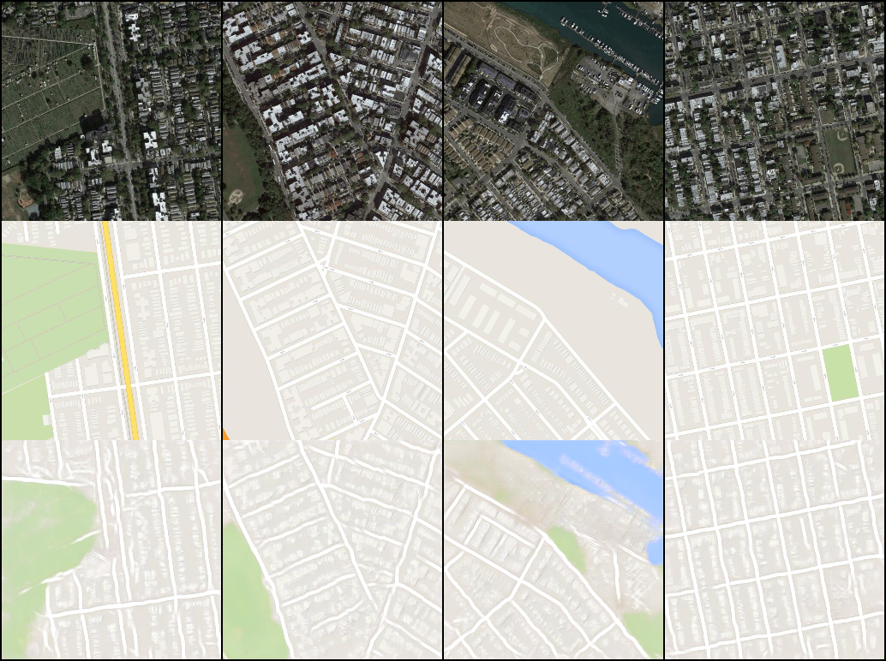
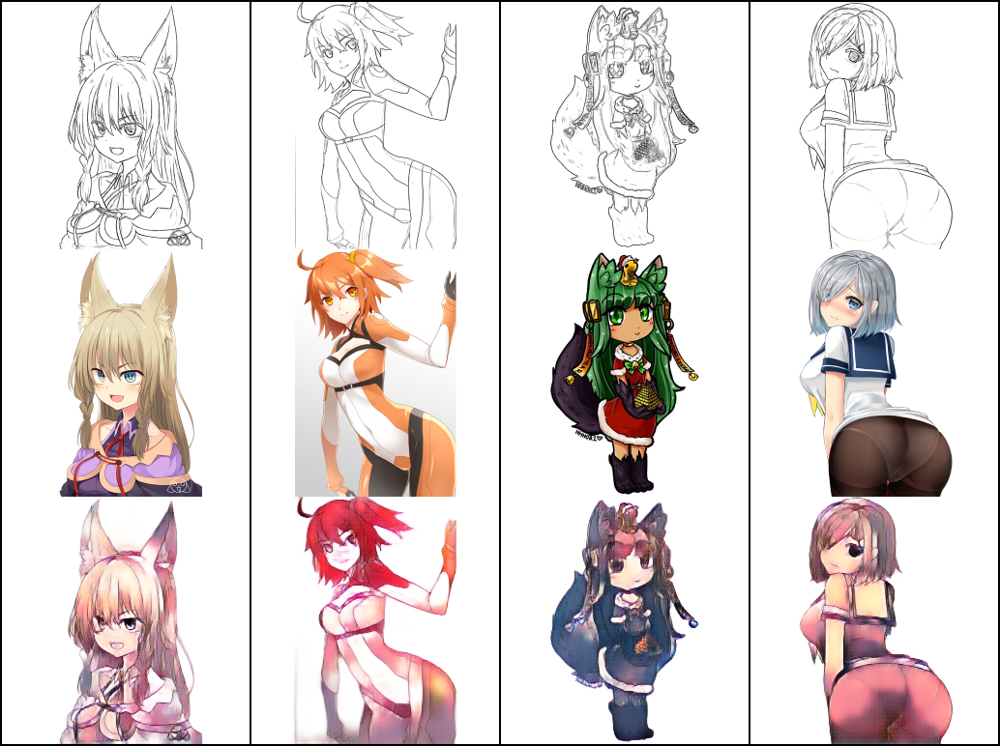

# Pix2Pix

This project is an implementaion of the orginal paper **[Image-to-Image Translation with Conditional Adversarial Networks](https://arxiv.org/abs/1611.07004)** and its code repo **[Pix2Pix](https://github.com/phillipi/pix2pix)**

## Project report
If you are intrested in going through the report click on this link [5 page brief report](Image_to_Image_Translation_with_Conditional_Adversarial_Networks-3.pdf)

## Results from Implementations
|1st row: Input Image / 2nd row: Grount Truth label / 3rd row: Translated Image|
|:---:|
|Aerial Image &rarr; Google Map|
||
|Anime sketch &rarr; Color sketeched anime|
||

## Evaluation 
Please use this **[evaluation notebook](pix2pix_evaluation.ipynb)** to evaluate on sample images/new images using [pretrained weights](https://drive.google.com/drive/folders/1UIvTQdePZz_1pKI9KrErS4I3AhQyzAIL?usp=sharing) (~630MB each generator).

```bash
git clone https://github.com/ummadiviany/Pix2Pix
```
```bash
cd Pix2Pix
```
```
jupyter notebook
```
Now open the **pix2pix_evaluation.ipynb** and run all the cells sequentially.

## Training
Use this **[training_notebook](Training_Notebook.ipynb)**. I have created seperate jupyter notebook for every dataset.

```bash
git clone https://github.com/ummadiviany/Pix2Pix
```
```bash
cd Pix2Pix
```
```
jupyter notebook
```

Now open the one of the training notebooks and all the cells sequentially.

## Datasets
|Dataset        | Training examples | Testing examples  | Size|
|---------------|-------------------|-------------------|-----|
|Maps           |1096               |1098               |<~1GB
|Anime Sketch   |14224              |3545               |7GB
|night2day      |~20k               |--                 |